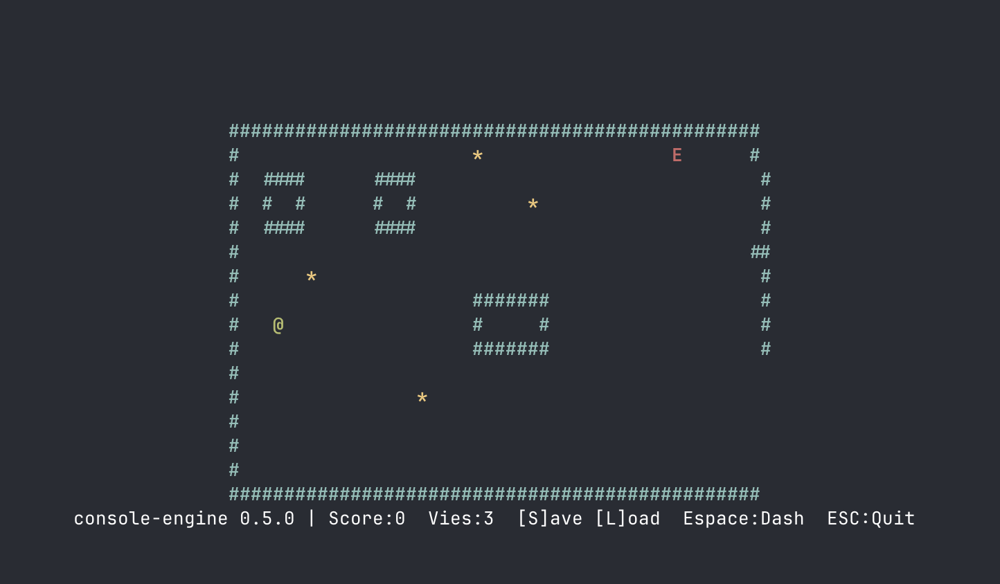

# C Console Engine

Petit jeu dans le terminal

## Lancer le jeu

```bash
make run
```

Objectif : Collecter tous les pièces tout en évitant les ennemis.

Input :

- Flèches directionnelles pour déplacer le joueur
- Espace pour dash
- S pour sauvegarder
- L pour charger

## Screenshot


